# Circuitos Logicos Programables: Modulo I2C (Master)

## Introduccion

### Aplicacion en proyecto final: 
#### Driver para camara con protocolo Seral Camera Control Bus (SCCB) y posterior procesamiento de imagenes en hardware dedicado.

### Diagrama de bloques:

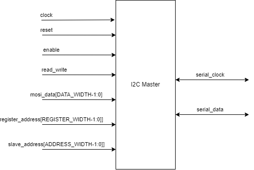

De especificacion, transferencia completa:

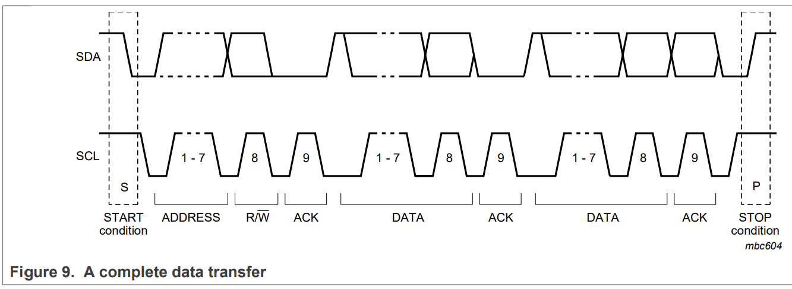

### Diagrama de estados (FSM):

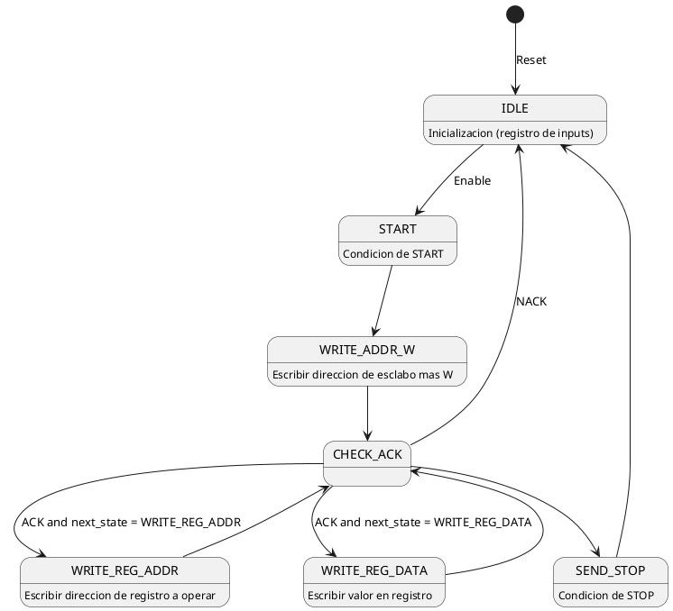

## Arquitectura

- IDLE:
```vhdl
-- The device address is sent with a 0 appended to the LSB to signify a write operation
-- Save slave address
saved_slave_address <= slave_address & "0";
-- Save target register address
saved_register_address <= register_address;
-- Save data to be written (valid in write op)
saved_mosi_data <= mosi_data; 
-- Save read/write status bit
saved_read_write <= read_write; 

serial_data_reg <= '1'; -- Hold SDA high
serial_clock_reg <= '1'; -- Hold SCL high
next_serial_data <= '0';

process_counter <= "00"; -- Init internal process
bit_counter <= std_logic_vector(to_unsigned(0, 8));
acknowledge <= '0';

if enable = '1' then
    state <= START; -- Proceed to START
    next_state <= WRITE_ADDR_W; -- Write address after START squence
else
    state <= IDLE; -- Stay IDLE
    next_state <= IDLE;
end if;
```

- START:

```vhdl
case process_counter is
    when "00" =>
        process_counter <= "01";
    when "01" =>
        process_counter <= "10";
        serial_data_reg <= '0'; -- SDA low
    when "10" =>
        process_counter <= "11";
        bit_counter <= std_logic_vector(to_unsigned(8, 8));
    when "11" =>
        process_counter <= "00";
        state <= next_state; -- Proceed to the next state
        serial_clock_reg <= '0'; -- SCL low
        -- Most significant bit is transmitted first
        serial_data_reg <= saved_slave_address(ADDRESS_WIDTH);
    when others =>
        state <= IDLE;
end case;
```

Especificacion:

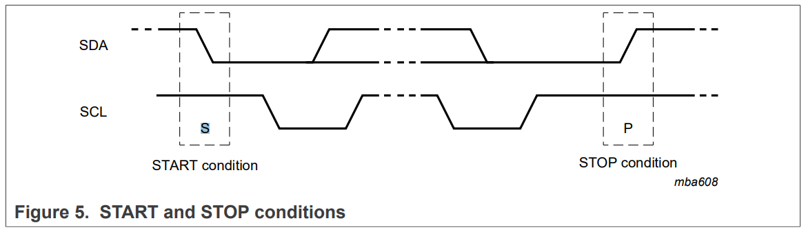

Simulacion:

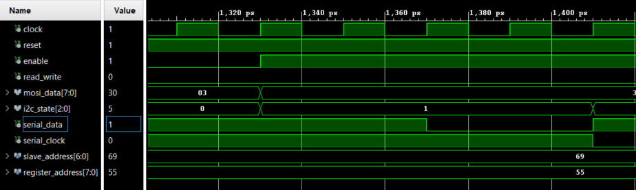

- WRITE_ADDR_W:

```vhdl
case process_counter is
    when "00" =>
        process_counter <= "01";
        serial_clock_reg <= '1'; -- SCL high
    when "01" =>
        -- chck for clock stretching
        -- if serial_clock /= '0' then
        process_counter <= "10";
        --end if;
    when "10" =>
        serial_clock_reg <= '0';
        process_counter <= "11";
        bit_counter <= std_logic_vector(to_unsigned(to_integer(unsigned(bit_counter)) - 1, 8));
    when "11" =>
        if bit_counter = "00000000" then
            next_serial_data <= saved_register_address(REGISTER_WIDTH-1);
            next_state <= WRITE_REG_ADDR;
            state <= CHECK_ACK;
            bit_counter <= std_logic_vector(to_unsigned(8, 8));
        else
            serial_data_reg <= saved_slave_address(to_integer(unsigned(bit_counter)) - 1);
        end if;
        process_counter <= "00";

    when others =>
        state <= IDLE;
end case;
```

Ejemplo slave address 0x69 :: 0b1101001

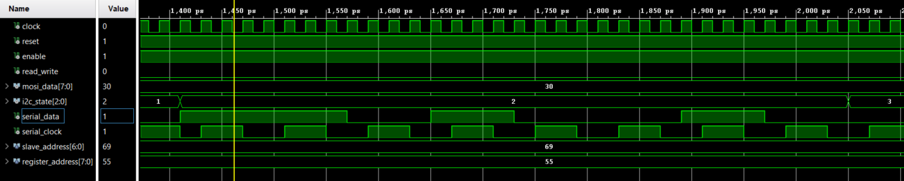

- CHECK_ACK:

```vhdl
case process_counter is
    when "00" =>
        serial_clock_reg <= '1';
        process_counter <= "01";
    when "01" =>
        -- check for clock stretching
        -- if serial_clock /= '0' then
        acknowledge <= '0';
        process_counter <= "10";
        -- end if;
    when "10" =>
        serial_clock_reg <= '0';
        process_counter <= "11";
        if serial_data_reg = '0' then
            acknowledge <= '1';
        end if;
    when "11" =>
        if acknowledge = '1' then
            acknowledge <= '0';
            serial_data_reg <= next_serial_data;
            state <= next_state;
        else
            state <= IDLE;
        end if;
        process_counter <= "00";

    when others =>
        state <= IDLE;
end case;
```

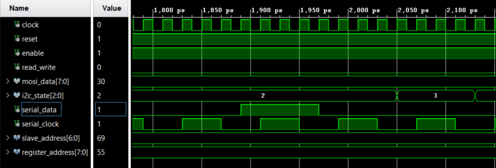

- WRITE_REG_ADDR:

```vhdl
case process_counter is
    when "00" =>
        serial_clock_reg <= '1';
        process_counter <= "01";
    when "01" =>
        -- check for clock stretching
        -- if serial_clock /= '0' then
        acknowledge <= '0';
        process_counter <= "10";
        -- end if;
    when "10" =>
        serial_clock_reg <= '0';
        bit_counter <= std_logic_vector(to_unsigned(to_integer(unsigned(bit_counter)) - 1, 8));
        process_counter <= "11";
    when "11" =>
        if bit_counter = "00000000" then
            if read_write = '0' then -- write op
                next_serial_data <= saved_mosi_data(DATA_WIDTH-1);
                next_state <= WRITE_REG_DATA;
            else -- read op
                next_state <= IDLE;
                next_serial_data <= '1';
            end if;
            bit_counter <= std_logic_vector(to_unsigned(8, 8));
            serial_data_reg <= '0';
            state <= CHECK_ACK;
        else
            serial_data_reg <= saved_register_address(to_integer(unsigned(bit_counter)) - 1);
        end if;
        process_counter <= "00";
    when others =>
        state <= IDLE;
end case;
```

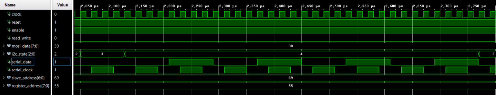

- WRITE_REG_DATA:

```vhdl
case process_counter is
    when "00" =>
        serial_clock_reg <= '1';
        process_counter <= "01";
    when "01" =>
        -- check for clock stretching
        -- if serial_clock /= '0' then
        acknowledge <= '0';
        process_counter <= "10";
        -- end if;
    when "10" =>
        serial_clock_reg <= '0';
        bit_counter <= std_logic_vector(to_unsigned(to_integer(unsigned(bit_counter)) - 1, 8));
        process_counter <= "11";
    when "11" =>
        if bit_counter = "00000000" then
            state <= CHECK_ACK;
            next_state <= SEND_STOP;
            next_serial_data <= '0';
            bit_counter <= std_logic_vector(to_unsigned(8, 8));
            serial_data_reg <= '0';
        else
            serial_data_reg <= saved_mosi_data(to_integer(unsigned(bit_counter)) - 1);
        end if;
        process_counter <= "00";
    when others =>
        state <= IDLE;
end case;
```

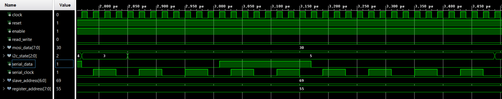

- STOP:

```vhdl
case process_counter is
    when "00" =>
        serial_clock_reg <= '1';
        process_counter <= "01";
    when "01" =>
        -- check for clock stretching
        -- if serial_clock /= '0' then
        acknowledge <= '0';
        process_counter <= "10";
        -- end if;
    when "10" =>
        serial_data_reg <= '1';
        process_counter <= "11";
    when "11" =>
        state <= IDLE;
    when others =>
        state <= IDLE;
end case;
```

Especificacion:


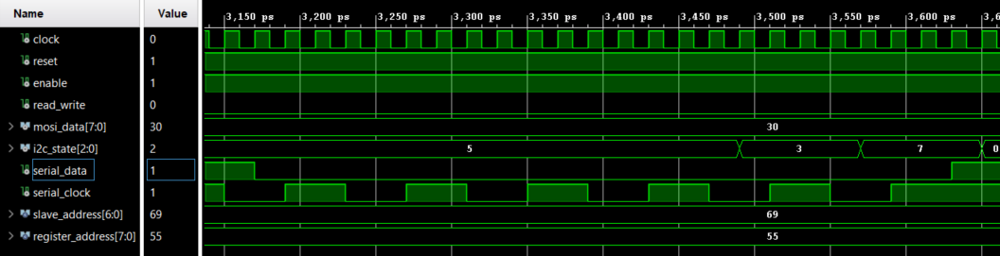

## Implementacion

### Esquematico RTL (+ VIO e ILA)

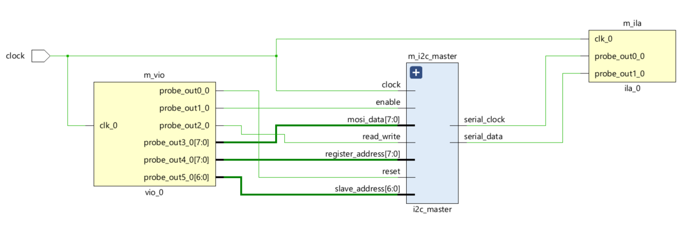

### Esquematico implementacion

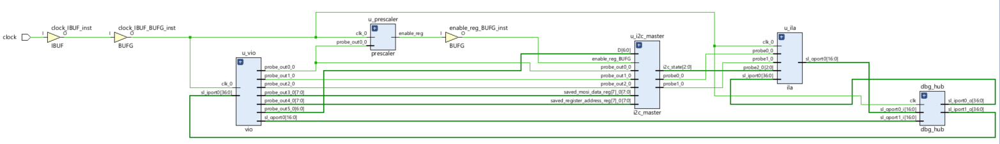

## Proximos pasos

- Operacion de lectura
- Liberar SDA y SCL 
- Funcionamiento de clock stretching
- Contemplar frecuencias de funcionamiento estandar